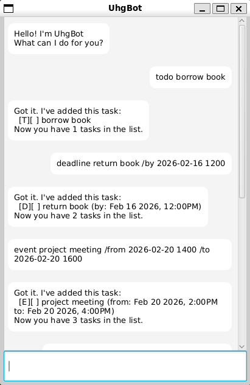

# UhgBot User Guide 🤖

> A desktop task management application that helps you keep track of your tasks through a friendly chat interface.



## Quick Start Guide 🚀

### Prerequisites
* Java Runtime Environment (JRE) 17 or above
* Windows/macOS/Linux operating system
* At least 100MB of free disk space

### Installation Steps
1. Download the latest version of UhgBot from our [releases page](https://github.com/UltimateHG/ip/releases)
2. Extract the downloaded ZIP file
3. Run the `UhgBot.jar` file by double-clicking it
4. If that doesn't work, run via command line:
   ```bash
   java -jar UhgBot.jar
   ```

## Features 📋

### 1. Task Management

#### Adding Tasks
* `todo DESCRIPTION` - Creates a basic todo task
* `deadline DESCRIPTION /by DATETIME` - Creates a task with deadline
* `event DESCRIPTION /from DATETIME /to DATETIME` - Creates an event

> Note: DATETIME format should be `yyyy-MM-dd HHmm` (e.g., `2024-03-15 1400`)

#### Managing Tasks
* `list` - Shows all tasks
* `mark INDEX` - Marks task as done
* `unmark INDEX` - Marks task as not done
* `delete INDEX` - Removes task from list

#### Task Scheduling
* `snooze INDEX DURATION` - Postpones a deadline/event
  * Duration format: `+<number><unit>`
  * Units: `d` (days), `h` (hours), `m` (minutes)
  * Example: `snooze 1 +2h` postpones task #1 by 2 hours

#### Search
* `find KEYWORD` - Finds tasks containing keyword

### Example Usage

```
// Create a todo
todo read book
> Got it. I've added this task:
>   [T][ ] read book
> Now you have 1 tasks in the list.

// Add deadline
deadline return book /by 2024-03-15 1400
> Got it. I've added this task:
>   [D][ ] return book (by: Mar 15 2024, 2:00PM)
> Now you have 2 tasks in the list.

// Create event
event team meeting /from 2024-03-15 1400 /to 2024-03-15 1600
> Got it. I've added this task:
>   [E][ ] team meeting (from: Mar 15 2024, 2:00PM to: Mar 15 2024, 4:00PM)
> Now you have 3 tasks in the list.
```

### Task Types

Type | Symbol | Description
---|---|---
Todo | `[T]` | Basic task without time constraint
Deadline | `[D]` | Task with specific due date/time
Event | `[E]` | Task with start and end time

### Status Indicators

Symbol | Meaning
---|---
`[ ]` | Task not done
`[X]` | Task completed

## Command Summary ⌨️

Command | Format | Example
---|---|---
Add todo | `todo DESCRIPTION` | `todo read book`
Add deadline | `deadline DESCRIPTION /by DATETIME` | `deadline return book /by 2024-03-15 1400`
Add event | `event DESCRIPTION /from DATETIME /to DATETIME` | `event meeting /from 2024-03-15 1400 /to 2024-03-15 1600`
List tasks | `list` | `list`
Mark done | `mark INDEX` | `mark 1`
Mark not done | `unmark INDEX` | `unmark 1`
Delete task | `delete INDEX` | `delete 1`
Find tasks | `find KEYWORD` | `find book`
Snooze task | `snooze INDEX DURATION` | `snooze 1 +2h`
Exit | `bye` | `bye`

## Data Storage 💾
* Tasks are automatically saved to `./data/uhgbot.txt`
* Data file is created automatically on first run
* Backup the data file regularly to prevent data loss